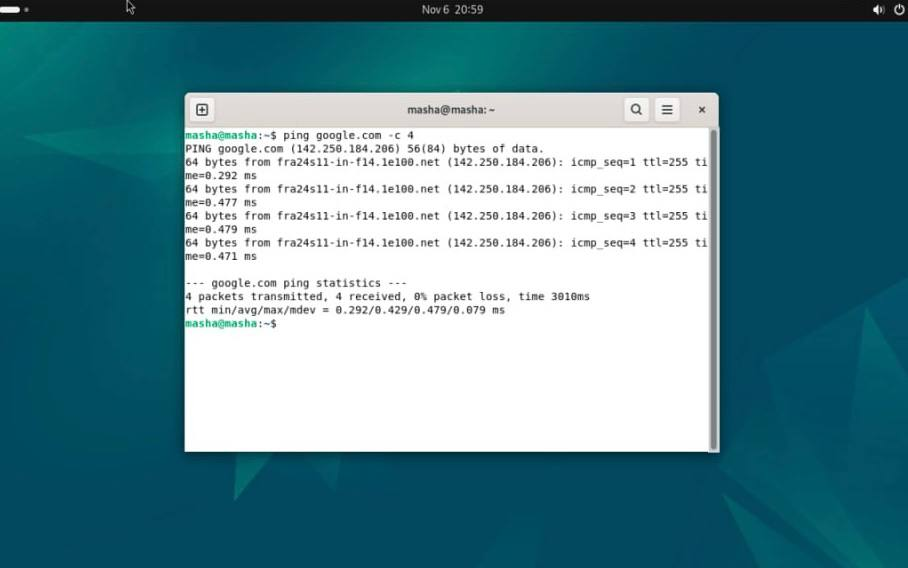
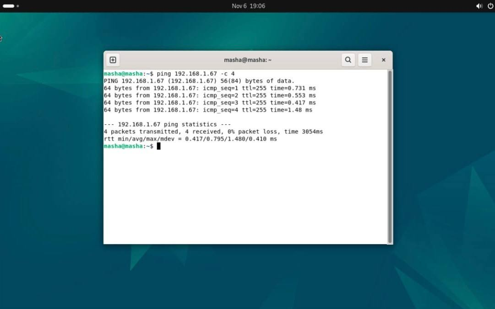
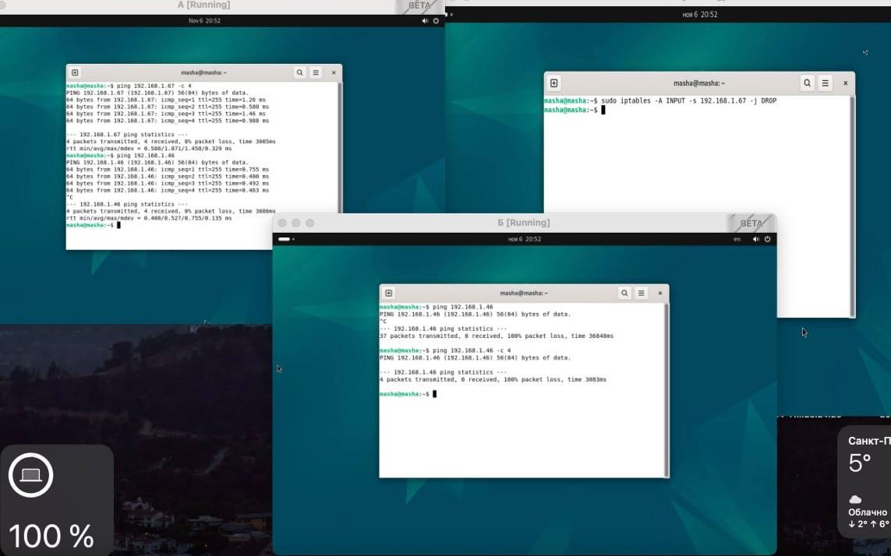

# Лабораторная работа №3 Пластинина Мария К3161
1) Я создала виртуальную машину с Ubuntu. При настройке сети я выбрала "Сетевой мост", чтобы виртуальные машины могли взаимодействовать друг с другом и выходить в Интернет через сеть хоста.

2) Я запустила виртуальную машину А и открыв терминал, выполнила команду ping google.com -c 4 для проверки подключения к Интернету.

3) Я создала вторую виртуальную машину Б с Ubuntu и с теми же настройками, что и для машины А.

4) После установки ОС на машине Б, я открыла терминал и ввела команду ip addr show для определения IP-адреса.

5) На машине А я выполнила команду ping, чтобы проверить доступ к машине Б.

6) Я создала третью виртуальную машину В с Ubuntu и с теми же настройками, что и для машин А и Б.

7) Открыв терминал на машине В и выполнив команду ip addr show, я определила IP-адрес этой машины. 

8) Чтобы проверить, что сетевые соединения между машинами установлены, я выполнила команду ping на машинах А и Б к IP-адресу машины В. 

9) Чтобы запретить доступ с машины Б на машину В, я  при помощи команды sudo iptables -A INPUT -s 193.168.1.67 -j DROP заблокировала все входящие подключения с машины Б.

10) Чтобы проверить настройки ограничений, на машине А я выполнила ping к IP-адресу машины В и убедилась, что пинг успешен. На машине Б выполнила ping к IP-адресу машины В и проверила, что пинг не проходит.

